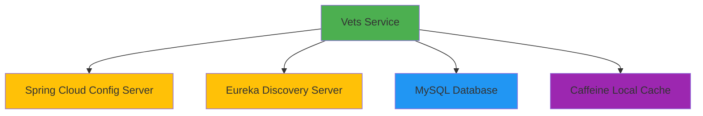
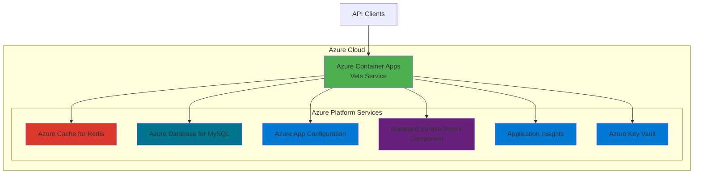

# Application Assessment Report
**Spring PetClinic Vets Service - Azure Modernization Assessment**

**Date**: 2026-02-03  
**Application**: vets-service  
**Version**: 3.4.1  

---

## Executive Summary

This assessment evaluates the Spring PetClinic Vets Service microservice for migration to Azure cloud platform, specifically targeting **Azure Kubernetes Service (AKS)**, **Azure App Service**, and **Azure Container Apps**. The application is a Spring Boot 3.4.1 microservice that manages veterinarian data for the PetClinic system.

### Overall Assessment Results
- **Total Issues Identified**: 7 issues (11 incidents)
- **Mandatory Issues**: 3 (6 incidents) - Must be resolved for successful migration
- **Potential Issues**: 1 (1 incident) - May require attention depending on deployment scenario
- **Optional Issues**: 3 (4 incidents) - Recommended improvements for optimal cloud operation
- **Estimated Total Effort**: 35 story points

---

## Application Profile

### Current Technology Stack
- **Framework**: Spring Boot 3.4.1
- **Java Version**: JDK 17
- **Build Tool**: Maven
- **Key Dependencies**:
  - Spring Cloud 2024.0.0
  - Spring Cloud Config Client
  - Spring Cloud Netflix Eureka Client
  - Spring Boot Actuator
  - Spring Data JPA
  - Azure Spring Cloud dependencies (5.20.1)
  - Caffeine Cache
  - MySQL Connector (with Azure JDBC support)
  - HSQLDB (for development/testing)

### Current Architecture


---

## Key Findings

### 1. Mandatory Issues (High Priority)

#### 1.1 Use of Unsecured Network Protocols (2 incidents)
**Severity**: Mandatory  
**Locations**: 
- `src/main/resources/application.yml:5` - `http://localhost:8888/`
- `src/main/resources/application.yml:16` - `http://config-server:8888`

**Issue**: The application uses HTTP (unsecured) protocol to connect to the Spring Cloud Config Server.

**Impact**: 
- Security vulnerability - configuration data transmitted in plain text
- Non-compliance with cloud security best practices
- Potential exposure of sensitive configuration data

**Recommendation**:
- Use HTTPS for all external communications
- Configure TLS/SSL certificates for Config Server
- Update connection URLs to use `https://` protocol

**Migration Path**:
```yaml
# Current (Insecure)
spring:
  config:
    import: optional:configserver:http://localhost:8888/

# Recommended (Secure)
spring:
  config:
    import: optional:configserver:https://localhost:8888/
```

---

#### 1.2 No Dockerfile Found (1 incident)
**Severity**: Mandatory  
**Location**: Project root

**Issue**: The application lacks containerization configuration (Dockerfile).

**Impact**: 
- Cannot be deployed to container-based Azure services (AKS, Container Apps)
- Blocks cloud-native deployment patterns

**Recommendation**:
Create a multi-stage Dockerfile optimized for Spring Boot applications:

```dockerfile
# Build stage
FROM maven:3.9-eclipse-temurin-17 AS build
WORKDIR /app
COPY pom.xml .
RUN mvn dependency:go-offline
COPY src ./src
RUN mvn clean package -DskipTests

# Runtime stage
FROM eclipse-temurin:17-jre-alpine
WORKDIR /app
COPY --from=build /app/target/*.jar app.jar
EXPOSE 8081
ENTRYPOINT ["java", "-jar", "app.jar"]
```

---

#### 1.3 Embedded Cache Management (3 incidents)
**Severity**: Mandatory  
**Locations**:
- `pom.xml:76` - Spring Boot Cache dependency
- `pom.xml:126` - Caffeine cache dependency
- `src/main/java/org/springframework/samples/petclinic/vets/system/CacheConfig.java` - Cache configuration

**Issue**: The application uses embedded local caching (Caffeine), which doesn't scale horizontally in distributed cloud environments.

**Impact**:
- Cache inconsistency across multiple instances
- Reduced effectiveness in multi-instance deployments
- Potential data staleness issues

**Recommendation**:
Migrate to a distributed caching solution:
- **Azure Cache for Redis** (recommended for production)
- Configure cache eviction policies
- Use Spring Boot Redis integration

**Migration Approach**:
1. Add Azure Cache for Redis dependency
2. Update cache configuration to use Redis
3. Remove Caffeine-specific configurations
4. Configure connection to Azure Redis instance

---

### 2. Potential Issues (Medium Priority)

#### 2.1 Eureka Client Embedded Framework (1 incident)
**Severity**: Potential  
**Location**: `pom.xml:95`

**Issue**: Application embeds Eureka client for service discovery.

**Impact**:
- For **Azure Container Apps**: Connection info can be injected at startup, but explicit configurations may conflict
- For **AKS/App Service**: May need alternative service discovery mechanisms

**Recommendation**:
- **For Azure Container Apps**: Leverage managed Eureka Server component
- **For AKS**: Consider Kubernetes native service discovery or Azure Service Mesh
- **For App Service**: Use Azure Front Door or Application Gateway for routing

**Action Items**:
- Review and remove hardcoded Eureka connection settings in:
  - Configuration files (will be overridden)
  - Command-line parameters
  - Environment variables
  - Java system properties

---

### 3. Optional Issues (Low Priority - Recommended)

#### 3.1 Spring Cloud Config Server Usage (1 incident)
**Severity**: Optional  
**Location**: `pom.xml:91`

**Issue**: Application uses Spring Cloud Config Server for centralized configuration.

**Impact**: Opportunity to leverage Azure-native configuration management

**Recommendation**:
Migrate to **Azure App Configuration**:
- Managed, centralized configuration store
- Native Spring Boot integration
- Feature flags support
- Enhanced security with Managed Identity

**Benefits**:
- Better integration with Azure ecosystem
- Centralized management across all services
- Built-in versioning and rollback
- No need to maintain separate Config Server

**Migration Path**:
1. Provision Azure App Configuration service
2. Migrate configuration keys from Config Server
3. Update dependencies to use Spring Cloud Azure App Configuration
4. Configure Managed Identity for secure access

---

#### 3.2 Jakarta EE Version Not Latest (1 incident)
**Severity**: Optional  
**Location**: `pom.xml:118` - `javax.cache:cache-api:1.1.1`

**Issue**: Application uses older Jakarta EE components (javax.cache).

**Impact**: Missing out on performance and security improvements

**Recommendation**:
- Review Jakarta EE release versions
- Identify compatible cache-api version
- Update dependency and test compatibility

---

#### 3.3 Hardcoded URLs in Configuration (2 incidents)
**Severity**: Optional  
**Locations**: 
- `application.yml:5` - localhost URL
- `application.yml:16` - config-server hostname

**Issue**: Configuration contains hardcoded service URLs.

**Impact**: Reduces portability and environment flexibility

**Recommendation**:
- Use environment variables for all external URLs
- Leverage Azure App Configuration for environment-specific settings
- Implement configuration profiles for different environments

**Example**:
```yaml
spring:
  config:
    import: optional:configserver:${CONFIG_SERVER_URL}
```

---

## Target Azure Architecture

### Recommended Target Architecture


### Benefits of Target Architecture
1. **Fully Managed Services**: No infrastructure management overhead
2. **Auto-scaling**: Automatic scale based on demand
3. **High Availability**: Built-in redundancy and failover
4. **Enhanced Security**: Managed Identity, Key Vault integration
5. **Observability**: Application Insights integration
6. **Cost Optimization**: Pay only for what you use

---

## Migration Roadmap

### Phase 1: Containerization (Effort: 8 points)
**Priority**: High - Prerequisite for all Azure container services

**Tasks**:
1. Create optimized Dockerfile
2. Create .dockerignore file
3. Build and test container image locally
4. Push image to Azure Container Registry

**Deliverables**:
- Working Dockerfile
- Container image in Azure Container Registry
- Documentation for container build process

---

### Phase 2: Security Hardening (Effort: 5 points)
**Priority**: High - Critical security issues

**Tasks**:
1. Update Config Server URLs to use HTTPS
2. Configure TLS/SSL certificates
3. Implement Azure Key Vault for secrets management
4. Enable Managed Identity for Azure resource access

**Deliverables**:
- Secure HTTPS connections
- Secrets stored in Key Vault
- Managed Identity configuration

---

### Phase 3: Cache Migration (Effort: 13 points)
**Priority**: High - Critical for multi-instance deployments

**Tasks**:
1. Provision Azure Cache for Redis
2. Update dependencies (remove Caffeine, add Redis)
3. Update cache configuration
4. Configure Redis connection with Managed Identity
5. Test cache functionality
6. Performance testing and optimization

**Deliverables**:
- Working Redis cache integration
- Performance test results
- Updated configuration documentation

---

### Phase 4: Configuration Migration (Effort: 5 points)
**Priority**: Medium - Improves manageability

**Tasks**:
1. Provision Azure App Configuration
2. Migrate configuration keys from Config Server
3. Update application dependencies
4. Configure App Configuration connection
5. Test configuration loading

**Deliverables**:
- Azure App Configuration setup
- Migrated configuration values
- Connection configuration

---

### Phase 5: Service Discovery Migration (Effort: 3 points)
**Priority**: Medium - Environment dependent

**Tasks**:
1. Remove hardcoded Eureka connection settings
2. Configure managed Eureka Server (for Container Apps)
3. Test service registration and discovery
4. Document service discovery configuration

**Deliverables**:
- Clean Eureka configuration
- Service discovery documentation

---

### Phase 6: Deployment & Optimization (Effort: 1 point)
**Priority**: Low - Nice to have

**Tasks**:
1. Update Jakarta EE dependencies
2. Externalize all hardcoded URLs
3. Implement environment-based configuration
4. Final testing and validation

**Deliverables**:
- Updated dependencies
- Externalized configuration
- Deployment documentation

---

## Recommended Deployment Target

### Option 1: Azure Container Apps (Recommended)
**Best for**: Microservices architecture with managed components

**Pros**:
- Managed Eureka Server integration (no code changes needed)
- Auto-scaling with KEDA
- Simplified networking and ingress
- Pay-per-use pricing model
- Integrated with Azure App Configuration

**Considerations**:
- Remove explicit Eureka connection configuration
- Leverage managed components (Eureka, Config)

---

### Option 2: Azure Kubernetes Service (AKS)
**Best for**: Complex orchestration requirements, multi-cloud strategy

**Pros**:
- Full Kubernetes ecosystem
- Maximum flexibility and control
- Supports all Kubernetes tools and patterns
- Multi-cloud portability

**Considerations**:
- More complex to manage
- Requires Kubernetes expertise
- Need to manage Eureka/Config Server deployments

---

### Option 3: Azure App Service
**Best for**: Simple deployment, monolithic approach

**Pros**:
- Easiest to deploy and manage
- Built-in CI/CD support
- Auto-scaling capabilities

**Considerations**:
- Limited microservices features
- May need alternative service discovery
- Less suitable for microservices architecture

---

## Security Considerations

### Current Security Gaps
1. ❌ Unencrypted HTTP communication with Config Server
2. ❌ No secrets management strategy
3. ⚠️ Hardcoded connection strings

### Recommended Security Enhancements
1. ✅ Azure Key Vault for secrets management
2. ✅ Managed Identity for passwordless authentication
3. ✅ HTTPS for all communications
4. ✅ Network security groups for traffic control
5. ✅ Application Insights for security monitoring
6. ✅ Azure Policy for compliance enforcement

---

## Cost Estimation

### Azure Container Apps (Recommended)
**Monthly Estimate** (production workload):
- Container Apps (2 replicas): ~$50-100
- Azure Cache for Redis (Basic): ~$15-50
- Azure Database for MySQL (B2s): ~$50-100
- Azure App Configuration: ~$1-10
- Application Insights: ~$10-50
- **Total**: ~$125-310/month

*Note: Actual costs depend on traffic, data storage, and scaling requirements*

---

## Risk Assessment

| Risk | Impact | Probability | Mitigation |
|------|--------|-------------|------------|
| Cache inconsistency in multi-instance | High | High | Migrate to Redis immediately |
| Security vulnerability (HTTP) | High | Medium | Implement HTTPS before production |
| Service discovery conflicts | Medium | Medium | Follow Azure Container Apps guidance |
| Configuration management complexity | Low | Low | Use Azure App Configuration |
| Migration downtime | Medium | Low | Implement blue-green deployment |

---

## Next Steps

### Immediate Actions (Week 1)
1. ✅ Review this assessment with stakeholders
2. 📋 Create Azure subscription and resource group (if not exists)
3. 🐳 Create Dockerfile for containerization
4. 🔒 Address security issues (HTTPS configuration)
5. 📊 Set up Azure Container Registry

### Short-term Actions (Week 2-4)
1. 🗄️ Provision Azure Cache for Redis
2. 🔧 Migrate cache implementation
3. ⚙️ Set up Azure App Configuration
4. 🔑 Implement Key Vault integration
5. 🧪 Comprehensive testing in Azure environment

### Long-term Actions (Month 2+)
1. 📈 Monitor and optimize performance
2. 💰 Review and optimize costs
3. 🔄 Implement CI/CD pipeline
4. 📚 Create operational runbooks
5. 🎯 Plan for remaining microservices migration

---

## Support Resources

### Azure Documentation
- [Azure Container Apps Overview](https://learn.microsoft.com/azure/container-apps/overview)
- [Azure Cache for Redis](https://learn.microsoft.com/azure/azure-cache-for-redis/)
- [Azure App Configuration](https://learn.microsoft.com/azure/azure-app-configuration/overview)
- [Eureka Server in Container Apps](https://learn.microsoft.com/azure/container-apps/java-eureka-server)
- [Spring Boot on Azure](https://learn.microsoft.com/azure/developer/java/spring/)

### Migration Guides
- [Migrate Spring Cloud to Azure Container Apps](https://learn.microsoft.com/azure/developer/java/migration/migrate-spring-cloud-to-azure-container-apps)
- [GitHub Copilot App Modernization](https://aka.ms/ghcp-appmod)

---

## Appendix

### A. Detailed Issue Breakdown

#### Issue Distribution by Category
- **Containerization**: 1 issue (Dockerfile missing)
- **Embedded Cache Management**: 3 incidents
- **Remote Communication**: 4 incidents (HTTP URLs, hardcoded URLs)
- **Spring Migration**: 2 incidents (Config Server, Eureka)
- **Framework Upgrade**: 1 incident (Jakarta EE)

#### Issue Distribution by Severity
- **Mandatory (6 incidents)**: Must fix for migration
  - Unsecured protocols: 2
  - Missing Dockerfile: 1
  - Embedded caching: 3
- **Potential (1 incident)**: Context-dependent
  - Eureka client: 1
- **Optional (4 incidents)**: Recommended improvements
  - Config Server: 1
  - Jakarta EE version: 1
  - Hardcoded URLs: 2

---

### B. Technology Compatibility Matrix

| Component | Current Version | Azure Compatible | Recommended Version | Notes |
|-----------|----------------|------------------|---------------------|-------|
| Spring Boot | 3.4.1 | ✅ Yes | 3.4.1 | Latest stable |
| Spring Cloud | 2024.0.0 | ✅ Yes | 2024.0.0 | Latest stable |
| JDK | 17 | ✅ Yes | 17 or 21 | 17 is minimum for Spring Boot 3 |
| MySQL | Runtime | ✅ Yes | Azure MySQL Flexible Server | Use Azure JDBC driver |
| Caffeine Cache | Local | ⚠️ Limited | Azure Cache for Redis | Required for multi-instance |
| Eureka Client | 4.2.0 | ✅ Yes | Managed Eureka (Container Apps) | Use managed service |

---

### C. Assessment Metadata

**Assessment Tool**: Java AppCAT CLI v1.0.0  
**Assessment Date**: 2026-02-03  
**Analysis Duration**: ~31 seconds  
**Target Platforms**: 
- Azure Kubernetes Service
- Azure App Service
- Azure Container Apps

**Privacy Mode**: Protected  
**Rule Sets Applied**: azure/springboot  

---

## Conclusion

The Spring PetClinic Vets Service is a well-architected Spring Boot microservice that requires moderate effort to migrate to Azure. The primary focus areas are:

1. **Containerization** - Essential first step
2. **Security hardening** - Critical for production
3. **Cache migration** - Critical for scalability
4. **Configuration management** - Recommended for manageability

With an estimated total effort of 35 story points and a phased approach, this migration can be completed in 4-6 weeks with a development team. The recommended target is **Azure Container Apps** due to its microservices-friendly features and managed components that align well with the current Spring Cloud architecture.

The application is already using modern frameworks (Spring Boot 3.4.1, JDK 17) which simplifies the migration process significantly. No framework upgrades are required, allowing the team to focus purely on Azure-specific optimizations.

---

**Report Generated**: 2026-02-03  
**Assessment Version**: 1.0  
**Status**: Ready for Migration Planning
